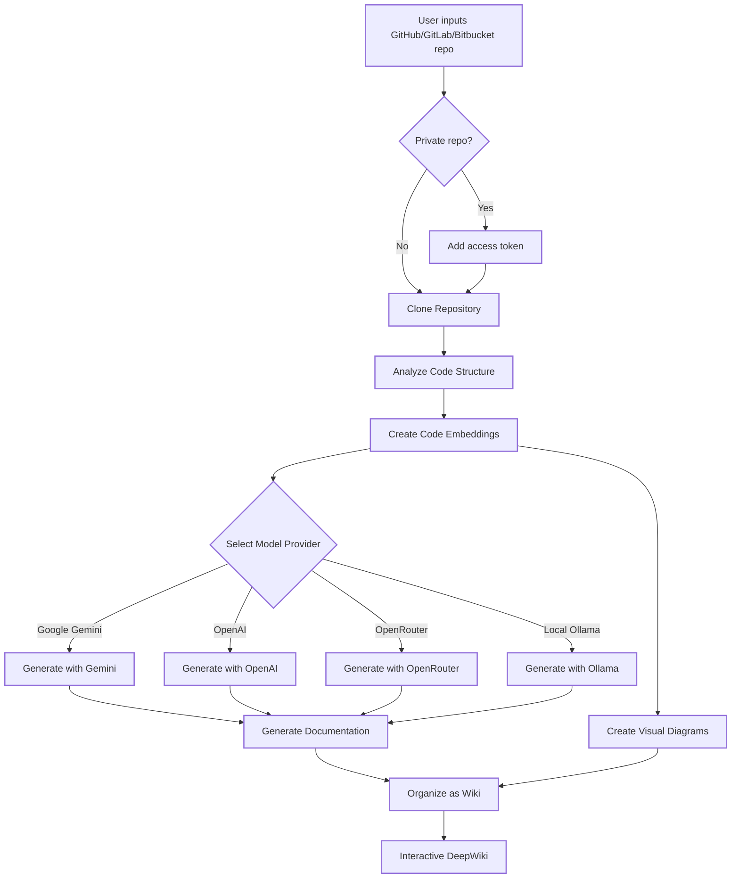
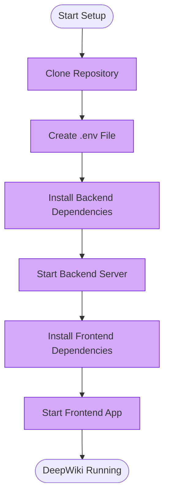
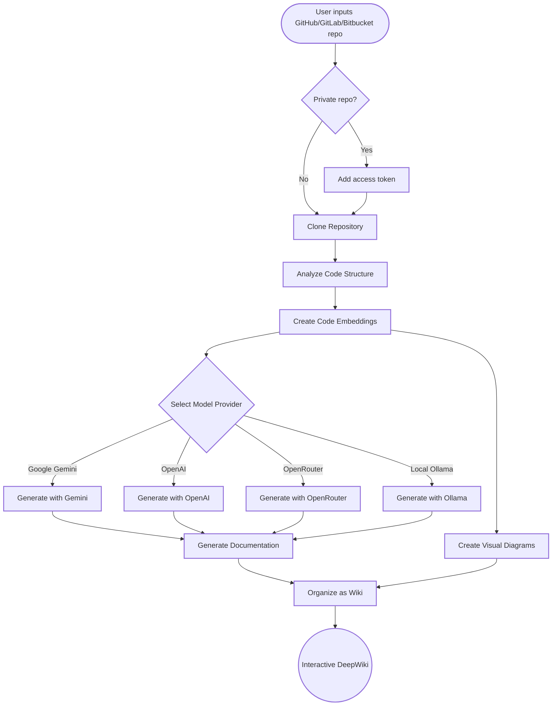
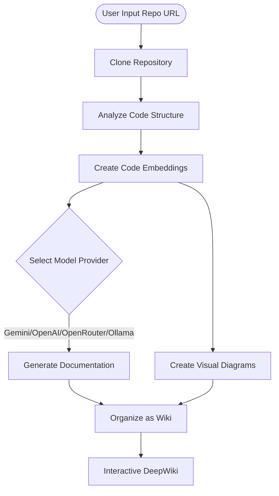
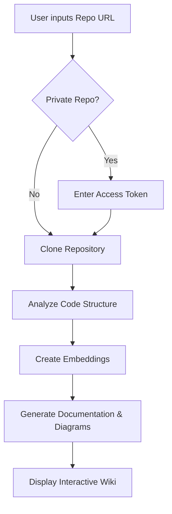

# Wiki Documentation for https://github.com/AsyncFuncAI/deepwiki-open

Generated on: 2025-05-07 14:46:10

## Table of Contents

- [Overview](#overview)
- [Setup and Installation](#setup)
- [Architecture and Workflow](#architecture)
- [Key Features: Ask, DeepResearch, and Model Providers](#features)
- [Backend API](#backend)
- [Frontend Application](#frontend)

<a id='overview'></a>

## Overview

### Related Files

- `README.md`

### Related Pages

Related topics: [Setup and Installation](#setup), [Architecture and Workflow](#architecture), [Key Features: Ask, DeepResearch, and Model Providers](#features)

## Overview

This page provides a high-level overview of the DeepWiki-Open project, an AI-powered tool designed to automatically generate comprehensive and interactive documentation for code repositories.

### Purpose and Functionality

DeepWiki-Open's core purpose is to simplify the process of creating documentation for GitHub, GitLab, and Bitbucket repositories. By leveraging Artificial Intelligence, it automates the analysis of code structure, generates detailed documentation, creates visual diagrams to illustrate code relationships and architecture, and organizes everything into an easy-to-navigate wiki format.

Key features include:

*   **Instant Documentation**: Quickly transform a repository into a structured wiki.
*   **Private Repository Support**: Access private repositories securely using personal access tokens.
*   **Smart Analysis**: AI-driven understanding of code structure.
*   **Beautiful Diagrams**: Automatic generation of Mermaid diagrams (Flow and Sequence) for visualization.
*   **Easy Navigation**: Intuitive interface for exploring the generated wiki.
*   **Ask Feature**: Chat with the repository content using RAG-powered AI.
*   **DeepResearch**: Conduct multi-turn research on complex topics within the repository.
*   **Multiple Model Providers**: Support for various AI models including Google Gemini, OpenAI, OpenRouter, and local Ollama.

### How It Works: Architecture and Integration

The process begins when a user provides a repository URL. DeepWiki analyzes whether it's a private repository and prompts for an access token if needed. The repository is then cloned, its code structure is analyzed, and code embeddings are created for smart retrieval. The system then uses these embeddings, along with a selected AI model provider (Google Gemini, OpenAI, OpenRouter, or local Ollama), to generate the documentation and visual diagrams. Finally, all generated content is organized into the interactive wiki interface.

This flow demonstrates the integration of several components:

1.  **Input Handling**: The frontend (`src/app/page.tsx`) captures user input (repo URL, tokens, model options).
2.  **Repository Processing**: The backend API (`api/main.py`) handles cloning, code analysis, and embedding creation.
3.  **AI Generation**: The API interacts with chosen AI models to generate text documentation and diagram code.
4.  **Diagram Generation**: The API generates Mermaid syntax based on code analysis.
5.  **Wiki Organization**: The generated content is structured into a wiki format.
6.  **Frontend Rendering**: The frontend displays the organized wiki, including rendering Mermaid diagrams using a component like `src/components/Mermaid.tsx`.
7.  **RAG/Ask Feature**: The `api/rag.py` module facilitates the intelligent Q&A by retrieving relevant code snippets to provide context to the AI model.

The entire process is orchestrated to transform raw code into a comprehensive, navigable, and interactive documentation resource.

The core workflow can be visualized with the following diagram:



### Configuration

Setting up DeepWiki-Open requires providing API keys for the AI models. This is typically done via a `.env` file in the project root:

```bash
GOOGLE_API_KEY=your_google_api_key
OPENAI_API_KEY=your_openai_api_key
# Optional: Add this if you want to use OpenRouter models
OPENROUTER_API_KEY=your_openrouter_api_key
```

### 🛠️ Project Structure

```
deepwiki/
├── api/                  # Backend API server
│   ├── main.py           # API entry point
│   ├── api.py            # FastAPI implementation
│   ├── rag.py            # Retrieval Augmented Generation
│   ├── data_pipeline.py  # Data processing utilities
│   └── requirements.txt  # Python dependencies
│
├── src/                  # Frontend Next.js app
│   ├── app/              # Next.js app directory
│   │   └── page.tsx      # Main application page
│   └── components/       # React components
│       └── Mermaid.tsx   # Mermaid diagram renderer
│
├── public/               # Static assets
├── package.json          # JavaScript dependencies
└── .env                  # Environment variables (create this)
```

### 🛠️ Advanced Setup

#### Environment Variables

| Variable                      | Description                                                                 | Required | Note                                                                                                    |
| ----------------------------- | --------------------------------------------------------------------------- | -------- | ------------------------------------------------------------------------------------------------------- |
| `GOOGLE_API_KEY`              | Google Gemini API key for AI generation                                     | Yes      |                                                                                                         |
| `OPENAI_API_KEY`              | OpenAI API key for embeddings                                               | Yes      |                                                                                                         |
| `OPENROUTER_API_KEY`          | OpenRouter API key for alternative models                                   | No       | Required only if you want to use OpenRouter models                                                        |
| `PORT`                        | Port for the API server (default: 8001)                                     | No       | If you host API and frontend on the same machine, make sure change port of `NEXT_PUBLIC_SERVER_BASE_URL` accordingly |
| `NEXT_PUBLIC_SERVER_BASE_URL` | Base URL for the API server (default: http://localhost:8001)                | No       |

### Docker Setup

You can use Docker to run DeepWiki:

```bash
# Pull the image from GitHub Container Registry
docker pull ghcr.io/asyncfuncai/deepwiki-open:latest

# Run the container with environment variables
docker run -p 8001:8001 -p 3000:3000 \
  -e GOOGLE_API_KEY=your_google_api_key \
  -e OPENAI_API_KEY=your_openai_api_key \
  -e OPENROUTER_API_KEY=your_openrouter_api_key \
  -v ~/.adalflow:/root/.adalflow \
  ghcr.io/asyncfuncai/deepwiki-open:latest
```

Or use the provided `docker-compose.yml` file:

```bash
# Edit the .env file with your API keys first
docker-compose up
```

#### Using a .env file with Docker

You can also mount a .env file to the container:

```bash
# Create a .env file with your API keys
echo "GOOGLE_API_KEY=your_google_api_key" > .env
echo "OPENAI_API_KEY=your_openai_api_key" >> .env
echo "OPENROUTER_API_KEY=your_openrouter_api_key" >> .env

# Run the container with the .env file mounted
docker run -p 8001:8001 -p 3000:3000 \
  -v $(pwd)/.env:/app/.env \
  -v ~/.adalflow:/root/.adalflow \
  ghcr.io/asyncfuncai/deepwiki-open:latest
```

#### Building the Docker image locally

If you want to build the Docker image locally:

```bash
# Clone the repository
git clone https://github.com/AsyncFuncAI/deepwiki-open.git
cd deepwiki-open

# Build the Docker image
docker build -t deepwiki-open .

# Run the container
docker run -p 8001:8001 -p 3000:3000 \
  -e GOOGLE_API_KEY=your_google_api_key \
  -e OPENAI_API_KEY=your_openai_api_key \
  -e OPENROUTER_API_KEY=your_openrouter_api_key \
  -v ~/.adalflow:/root/.adalflow \
  deepwiki-open
```

### 🔍 How It Works

DeepWiki uses AI to:

1.  Clone and analyze the GitHub, GitLab, or Bitbucket repository (including private repos with token authentication)
2.  Create embeddings of the code for smart retrieval
3.  Generate documentation with context-aware AI (using Google Gemini, OpenAI, OpenRouter, or local Ollama models)
4.  Create visual diagrams to explain code relationships
5.  Organize everything into a structured wiki
6.  Enable intelligent Q&A with the repository through the Ask feature
7.  Provide in-depth research capabilities with DeepResearch


### 🤖 Ask and DeepResearch Features

#### Ask Feature

The Ask feature allows you to chat with your repository using Retrieval Augmented Generation (RAG):

*   **Context-Aware Responses**: Get accurate answers based on the actual code in your repository
*   **RAG-Powered**: The system retrieves relevant code snippets to provide grounded responses
*   **Real-Time Streaming**: See the generated responses in real-time for a more interactive experience
*   **Conversation History**: The system maintains context between questions for more coherent interactions

#### DeepResearch Feature

DeepResearch takes repository analysis to the next level with a multi-turn research process:

*   **In-Depth Investigation**: Thoroughly explore complex topics through multiple research iterations
*   **Structured Process**: Follows a clear research plan, complete with updates and a comprehensive conclusion
*   **Automatic Continuation**: The AI automatically continues the research until a conclusion is reached (up to 5 iterations)
*   **Research Stages**:
    1.  **Research Plan**: Outlines the approach and initial findings
    2.  **Research Updates**: Builds on previous iterations with new insights
    3.  **Final Conclusion**: Provides a comprehensive answer based on all iterations

To use DeepResearch, simply toggle the "Deep Research" switch in the Ask interface before submitting your question.

### 🚀 DeepWiki API

This is the backend API for DeepWiki, providing smart code analysis and AI-powered documentation generation.

#### ✨ Features

*   **Streaming AI Responses**: Real-time responses using Google's Generative AI (Gemini)
*   **Smart Code Analysis**: Automatically analyzes GitHub repositories
*   **RAG Implementation**: Retrieval Augmented Generation for context-aware responses
*   **Local Storage**: All data stored locally - no cloud dependencies
*   **Conversation History**: Maintains context across multiple questions

#### 🔧 Quick Setup

##### Step 1: Install Dependencies

```bash
# From the project root
pip install -r api/requirements.txt
```

##### Step 2: Set Up Environment Variables

Create a `.env` file in the project root:

```
GOOGLE_API_KEY=your_google_api_key  # For AI generation
OPENAI_API_KEY=your_openai_api_key  # For embeddings
PORT=8001  # Optional, defaults to 8001
```

> 💡 **Where to get these keys:**
>
> *   Get a Google API key from [Google AI Studio](https://makersuite.google.com/app/apikey)
> *   Get an OpenAI API key from [OpenAI Platform](https://platform.openai.com/api-keys)

##### Step 3: Start the API Server

```bash
# From the project root
python -m api.main
```

The API will be available at `http://localhost:8001`

#### 🧠 How It Works

##### 1. Repository Indexing

When you provide a GitHub repository URL, the API:

*   Clones the repository locally (if not already cloned)
*   Reads all files in the repository
*   Creates embeddings for the files using OpenAI
*   Stores the embeddings in a local database

##### 2. Smart Retrieval (RAG)

When you ask a question:

*   The API finds the most relevant code snippets
*   These snippets are used as context for the AI
*   The AI generates a response based on this context

##### 3. Real-Time Streaming

*   Responses are streamed in real-time
*   You see the answer as it's being generated
*   This creates a more interactive experience

#### 📡 API Endpoints

##### GET /

Returns basic API information and available endpoints.

##### POST /chat/completions/stream

Streams an AI-generated response about a GitHub repository.

**Request Body:**

```json
{
  "repo_url": "https://github.com/username/repo",
  "messages": [
    {
      "role": "user",
      "content": "What does this repository do?"
    }
  ],
  "filePath": "optional/path/to/file.py"  // Optional
}
```

**Response:**

A streaming response with the generated text.

#### 📝 Example Code

```python
import requests

# API endpoint
url = "http://localhost:8001/chat/completions/stream"

# Request data
payload = {
    "repo_url": "https://github.com/AsyncFuncAI/deepwiki-open",
    "messages": [
        {
            "role": "user",
            "content": "What does this repository do?"
        }
    ]
}

# Send the request
response = requests.post(url, json=payload, stream=True)

# Print the streaming response
for chunk in response.iter_content(chunk_size=None, decode_unicode=True):
    if chunk:
        print(chunk, end='', flush=True)
```

### 📱 Screenshots


*DeepWiki's Main Interface*


*Accessing Private Repositories with a Personal Access Token*


*DeepResearch Performs Multi-Turn Investigations for Complex Topics*

#### Demo Video

[](https://youtu.be/zGANs8US8B4)

*Watch DeepWiki in Action!*

### ❓ Troubleshooting

#### API Key Issues

*   **"Missing environment variables"**: Make sure your `.env` file is in the project root and contains the required API keys
*   **"API key not valid"**: Check that you've copied the full key correctly with no extra spaces
*   **"OpenRouter API error"**: Verify your OpenRouter API key is valid and has sufficient credits

#### Connection Problems

*   **"Cannot connect to API server"**: Make sure the API server is running on port 8001
*   **"CORS error"**: The API is configured to allow all origins, but if you're having issues, try running both frontend and backend on the same machine

#### Generation Issues

*   **"Error generating wiki"**: For very large repositories, try a smaller one first
*   **"Invalid repository format"**: Make sure you're using a valid GitHub, GitLab or Bitbucket URL format
*   **"Could not fetch repository structure"**: For private repositories, ensure you've entered a valid personal access token with appropriate permissions
*   **"Diagram rendering error"**: The app will automatically try to fix broken diagrams

#### Common Solutions

1.  **Restart both servers**: Sometimes a simple restart fixes most issues
2.  **Check console logs**: Open browser developer tools to see any JavaScript errors
3.  **Check API logs**: Look at the terminal where the API is running for Python errors

### 🤝 Contributing

Contributions are welcome! Feel free to:

*   Open issues for bugs or feature requests
*   Submit pull requests to improve the code
*   Share your feedback and ideas

### 📄 License

This project is licensed under the MIT License - see the [LICENSE](LICENSE) file for details.

### ⭐ Star History

[](https://star-history.com/#AsyncFuncAI/deepwiki-open&Date)

Sources:

*   [README.md](https://github.com/AsyncFuncAI/deepwiki-open/blob/main/README.md)
*   [api/main.py](https://github.com/AsyncFuncAI/deepwiki-open/blob/main/api/main.py)
*   [src/app/page.tsx](https://github.com/AsyncFuncAI/deepwiki-open/blob/main/src/app/page.tsx)
*   [api/rag.py](https://github.com/AsyncFuncAI/deepwiki-open/blob/main/api/rag.py)


---

<a id='setup'></a>

## Setup and Installation

### Related Files

- `README.md`
- `Dockerfile`
- `docker-compose.yml`
- `.env`
- `api/requirements.txt`
- `package.json`

### Related Pages

Related topics: [Overview](#overview)

## Setup and Installation

Setting up and installing DeepWiki-Open is the crucial first step to transforming your code repositories into interactive wikis. This section guides you through the necessary configurations and steps to get the application running on your local machine, whether you prefer a manual setup or utilizing Docker.

### Purpose and Functionality

The setup process involves configuring the environment, installing dependencies for both the backend API and the frontend web application, and starting the respective servers. Once successfully set up, the application allows you to input a repository URL, configure options (like API keys for AI models), and generate a comprehensive, AI-powered wiki with documentation and visual diagrams.

### Key Files

Several key files are involved in the setup and configuration process:

*   `.env`: This file is used to store essential environment variables, most importantly your API keys for the AI models (Google Gemini, OpenAI) and optionally configuration for OpenRouter and server ports. It is critical for the application to function correctly.
    <p>Sources: <a href="https://github.com/AsyncFuncAI/deepwiki-open/blob/main/.env" target="_blank" rel="noopener noreferrer" class="mb-1 mr-1 inline-flex items-stretch font-mono text-xs !no-underline">.env</a></p>
*   `api/requirements.txt`: This file lists the Python dependencies required for the backend API server. These libraries include frameworks like FastAPI, tools for RAG, and potentially libraries for interacting with AI models and version control systems.
    <p>Sources: <a href="https://github.com/AsyncFuncAI/deepwiki-open/blob/main/api/requirements.txt" target="_blank" rel="noopener noreferrer" class="mb-1 mr-1 inline-flex items-stretch font-mono text-xs !no-underline">api/requirements.txt</a></p>
*   `package.json`: Located in the project root, this file lists the JavaScript dependencies for the Next.js frontend application. It includes libraries for the UI, state management, markdown rendering, and other frontend functionalities.
    <p>Sources: <a href="https://github.com/AsyncFuncAI/deepwiki-open/blob/main/package.json" target="_blank" rel="noopener noreferrer" class="mb-1 mr-1 inline-flex items-stretch font-mono text-xs !no-underline">package.json</a></p>
*   `Dockerfile`: This file contains instructions for building a Docker image for DeepWiki-Open. It defines the environment, copies the application code, installs dependencies, and specifies the command to run the application within a container.
    <p>Sources: <a href="https://github.com/AsyncFuncAI/deepwiki-open/blob/main/Dockerfile" target="_blank" rel="noopener noreferrer" class="mb-1 mr-1 inline-flex items-stretch font-mono text-xs !no-underline">Dockerfile</a></p>
*   `docker-compose.yml`: This file is used with Docker Compose to define and manage multi-container Docker applications. It specifies the services (like the DeepWiki app), their build context or image, ports, environment variables, and volumes, simplifying the orchestration of the frontend and backend.
    <p>Sources: <a href="https://github.com/AsyncFuncAI/deepwiki-open/blob/main/docker-compose.yml" target="_blank" rel="noopener noreferrer" class="mb-1 mr-1 inline-flex items-stretch font-mono text-xs !no-underline">docker-compose.yml</a></p>
*   `README.md`: The main README file serves as the primary documentation for the project, including the quick start guide and detailed instructions for both manual and Docker-based setup.
    <p>Sources: <a href="https://github.com/AsyncFuncAI/deepwiki-open/blob/main/README.md" target="_blank" rel="noopener noreferrer" class="mb-1 mr-1 inline-flex items-stretch font-mono text-xs !no-underline">README.md</a></p>

### Installation Methods

There are two primary ways to install and run DeepWiki-Open:

#### Manual Setup (Recommended)

1.  **Clone the repository:**
    ```bash
    git clone https://github.com/AsyncFuncAI/deepwiki-open.git
    cd deepwiki-open
    ```
2.  **Set Up Your API Keys:** Create a `.env` file in the project root.
    ```bash
    echo "GOOGLE_API_KEY=your_google_api_key" > .env
    echo "OPENAI_API_KEY=your_openai_api_key" >> .env
    # Optional: Add OpenRouter API key if needed
    echo "OPENROUTER_API_KEY=your_openrouter_api_key" >> .env
    ```
3.  **Start the Backend:** Install Python dependencies and run the API server.
    ```bash
    pip install -r api/requirements.txt
    python -m api.main
    ```
4.  **Start the Frontend:** Install JavaScript dependencies and run the web app.
    ```bash
    npm install
    # or yarn install
    npm run dev
    # or yarn dev
    ```
5.  **Use DeepWiki:** Open `http://localhost:3000` in your browser.

#### Docker Setup

DeepWiki-Open can also be run using Docker. You can either pull the pre-built image or build it locally.

*   **Using Docker Compose:**
    1.  Create the `.env` file as described in the manual setup.
    2.  Run Docker Compose from the project root:
        ```bash
        docker-compose up
        ```
*   **Using Docker Run:**
    ```bash
    docker pull ghcr.io/asyncfuncai/deepwiki-open:latest
    docker run -p 8001:8001 -p 3000:3000 \
      -e GOOGLE_API_KEY=your_google_api_key \
      -e OPENAI_API_KEY=your_openai_api_key \
      -v ~/.adalflow:/root/.adalflow \
      ghcr.io/asyncfuncai/deepwiki-open:latest
    ```
    (Add `-e OPENROUTER_API_KEY=your_openrouter_api_key` if using OpenRouter)

### Setup Process Flow

Here is a diagram illustrating the manual setup process:



### Integration with Overall Architecture

The setup process is fundamental to the DeepWiki-Open architecture. It ensures that the two main components – the Python backend API (`api/`) and the Next.js frontend application (`src/`) – are correctly installed and configured. The `.env` file acts as the bridge, providing the necessary API keys and the backend server URL (`NEXT_PUBLIC_SERVER_BASE_URL`) to the frontend. The backend handles the heavy lifting of repository cloning, code analysis, embedding creation, and AI-powered generation via RAG, while the frontend provides the user interface for inputting repository details, viewing the generated wiki, and interacting via the chat features. Successful installation means both components are operational and can communicate, allowing the user to leverage the full functionality of DeepWiki-Open.

---

<a id='architecture'></a>

## Architecture and Workflow

### Related Files

- `README.md`
- `api/main.py`
- `api/api.py`
- `api/data_pipeline.py`
- `src/components/Mermaid.tsx`

### Related Pages

Related topics: [Overview](#overview), [Key Features: Ask, DeepResearch, and Model Providers](#features), [Backend API](#backend)

## Architecture and Workflow

This page provides an overview of the architecture and the main workflow of the DeepWiki-Open application. It describes how the system processes a user's request to generate a wiki from a code repository, from initial input to the final interactive wiki output.

DeepWiki-Open follows a client-server architecture, consisting of a Next.js frontend application and a Python FastAPI backend API. The frontend handles user interaction and displays the generated wiki, while the backend performs the heavy lifting of repository analysis, documentation generation, and diagram creation using AI.

### The Wiki Generation Workflow

The core functionality of DeepWiki is the automated generation of a comprehensive wiki from a given code repository. The process involves several key steps, orchestrated between the frontend and the backend:

1.  **User Input:** The user provides a GitHub, GitLab, or Bitbucket repository URL or `owner/repo` string via the frontend interface.
2.  **Private Repository Handling:** If the repository is private, the user is prompted to add a personal access token for authentication.
3.  **Repository Cloning:** The backend clones the specified repository.
4.  **Code Analysis:** The backend analyzes the code structure to understand its components and relationships.
5.  **Code Embeddings Creation:** Embeddings of the code are created, which are used later for smart retrieval in features like the Ask function.
6.  **Model Selection:** The system uses the selected AI model provider (Google Gemini, OpenAI, OpenRouter, or local Ollama) for subsequent generation tasks.
7.  **Documentation Generation:** AI models generate comprehensive documentation based on the code analysis.
8.  **Visual Diagram Creation:** The backend generates visual diagrams (like flow and sequence diagrams) using Mermaid syntax to illustrate code architecture and data flow.
9.  **Wiki Organization:** The generated documentation and diagrams are organized into a structured wiki format.
10. **Interactive DeepWiki:** The frontend receives the structured wiki content and renders it as an interactive web page, including the visual diagrams.

The following diagram illustrates this workflow:



*Sources:*
<p>Sources: <a href="https://github.com/AsyncFuncAI/deepwiki-open/blob/main/README.md" target="_blank" rel="noopener noreferrer" class="mb-1 mr-1 inline-flex items-stretch font-mono text-xs !no-underline">README.md</a></p>

### Key Components and Their Roles

Several files and components are central to implementing this architecture and workflow:

*   **`README.md`**: This file serves as the primary documentation entry point, providing a high-level overview of the project, features, quick start instructions, and the conceptual workflow diagram. It's the user's first guide to understanding how DeepWiki works and how to set it up.

    <p>Sources: <a href="https://github.com/AsyncFuncAI/deepwiki-open/blob/main/README.md" target="_blank" rel="noopener noreferrer" class="mb-1 mr-1 inline-flex items-stretch font-mono text-xs !no-underline">README.md</a></p>

*   **`api/main.py`**: This is the main entry point for the backend FastAPI application. It's responsible for starting the API server and likely includes the initial setup and configuration required for the backend services.

    ```python
    # api/main.py
    import uvicorn
    from fastapi import FastAPI
    from fastapi.middleware.cors import CORSMiddleware
    from api.api import api_router
    
    app = FastAPI(
        title="DeepWiki",
        description="DeepWiki is an AI-powered tool that generates documentation for your code repositories.",
        version="0.1.0",
    )
    
    # CORS configuration
    origins = ["*"]  # Allows all origins
    
    app.add_middleware(
        CORSMiddleware,
        allow_origins=origins,
        allow_credentials=True,
        allow_methods=["*"],
        allow_headers=["*"],
    )
    
    app.include_router(api_router)
    
    if __name__ == "__main__":
        uvicorn.run(app, host="0.0.0.0", port=8001)
    ```

    <p>Sources: <a href="https://github.com/AsyncFuncAI/deepwiki-open/blob/main/api/main.py" target="_blank" rel="noopener noreferrer" class="mb-1 mr-1 inline-flex items-stretch font-mono text-xs !no-underline">api/main.py</a></p>

*   **`api/api.py`**: This file contains the core FastAPI application logic. It defines the API endpoints that the frontend interacts with, such as the endpoint for initiating the wiki generation process. It handles incoming requests, triggers the workflow steps (cloning, analysis, generation, etc.), and returns the results.

    <p>Sources: <a href="https://github.com/AsyncFuncAI/deepwiki-open/blob/main/api/api.py" target="_blank" rel="noopener noreferrer" class="mb-1 mr-1 inline-flex items-stretch font-mono text-xs !no-underline">api/api.py</a></p>

*   **`api/data_pipeline.py`**: This file likely contains utility functions and classes used within the API for data processing tasks. This could include functions for cloning repositories, reading and processing code files, preparing data for AI models, or handling embeddings.

    <p>Sources: <a href="https://github.com/AsyncFuncAI/deepwiki-open/blob/main/api/data_pipeline.py" target="_blank" rel="noopener noreferrer" class="mb-1 mr-1 inline-flex items-stretch font-mono text-xs !no-underline">api/data_pipeline.py</a></p>

*   **`src/components/Mermaid.tsx`**: This React component is part of the frontend application. Its purpose is to take Mermaid syntax (generated by the backend) and render it as a visual diagram within the web page. It uses the `mermaid` JavaScript library to achieve this.

    ```tsx
    // src/components/Mermaid.tsx
    import React, { useEffect, useRef } from 'react';
    import mermaid from 'mermaid';
    
    interface MermaidProps {
      chart: string;
    }
    
    const Mermaid: React.FC<MermaidProps> = ({ chart }) => {
      const mermaidRef = useRef(null);
    
      useEffect(() => {
        async function renderMermaid() {
          if (mermaidRef.current) {
            mermaid.initialize({
              startOnLoad: false,
              securityLevel: 'loose',
              theme: 'dark',
            });
    
            try {
              mermaid.render('mermaid-diagram', chart, (svgCode) => {
                if (mermaidRef.current) {
                  mermaidRef.current.innerHTML = svgCode;
                }
              });
            } catch (error) {
              console.error("Failed to render Mermaid diagram:", error);
              mermaidRef.current.innerHTML = "<p>Error rendering diagram.</p>";
            }
          }
        }
    
        renderMermaid();
      }, [chart]);
    
      return <div ref={mermaidRef} />;
    };
    
    export default Mermaid;
    ```

    <p>Sources: <a href="https://github.com/AsyncFuncAI/deepwiki-open/blob/main/src/components/Mermaid.tsx" target="_blank" rel="noopener noreferrer" class="mb-1 mr-1 inline-flex items-stretch font-mono text-xs !no-underline">src/components/Mermaid.tsx</a></p>

### Integration

The frontend and backend integrate via API calls. The user's request from the frontend (`src/app/page.tsx`) is sent to an endpoint defined in `api/api.py`. The backend then executes the workflow steps, potentially utilizing utilities in `api/data_pipeline.py`. Once the wiki content and diagram syntax are generated, they are sent back to the frontend. The `src/components/Mermaid.tsx` component specifically receives the Mermaid syntax string and renders the corresponding diagram, making the visual representation of the code architecture and workflow accessible to the user within the generated wiki page.


---

<a id='features'></a>

## Key Features: Ask, DeepResearch, and Model Providers

### Related Files

- `README.md`
- `api/rag.py`
- `api/openrouter_client.py`
- `api/ollama_patch.py`
- `src/components/Ask.tsx`

### Related Pages

Related topics: [Overview](#overview), [Architecture and Workflow](#architecture), [Backend API](#backend), [Frontend Application](#frontend)

## Key Features: Ask, DeepResearch, and Model Providers

DeepWiki-Open offers advanced AI-powered features for interacting with code repositories. The **Ask** and **DeepResearch** features, powered by **Retrieval Augmented Generation (RAG)** and support for **Multiple Model Providers**, allow you to query your codebase directly and conduct in-depth investigations.

### Ask Feature

The Ask feature enables you to have a conversation with your repository. By leveraging RAG, it retrieves relevant code snippets and information from the cloned repository to provide accurate, context-aware answers to your questions.

**Functionality:**

*   **Context-Aware Responses:** Answers are grounded in the actual content of your repository.
*   **RAG-Powered:** The system fetches relevant code sections to inform its responses.
*   **Real-Time Streaming:** Responses are streamed as they are generated for a dynamic user experience.
*   **Conversation History:** Maintains context across multiple questions for a coherent chat.

This feature is primarily handled in the backend by the RAG logic (`api/rag.py`) and presented to the user via the frontend component (`src/components/Ask.tsx`).

Sources: <a href="https://github.com/AsyncFuncAI/deepwiki-open/blob/main/src/components/Ask.tsx" target="_blank" rel="noopener noreferrer" class="mb-1 mr-1 inline-flex items-stretch font-mono text-xs !no-underline">src/components/Ask.tsx</a>, <a href="https://github.com/AsyncFuncAI/deepwiki-open/blob/main/api/rag.py" target="_blank" rel="noopener noreferrer" class="mb-1 mr-1 inline-flex items-stretch font-mono text-xs !no-underline">api/rag.py</a>

### DeepResearch Feature

Building upon the Ask feature, DeepResearch allows for more complex, multi-turn investigations into specific topics within the repository. It conducts a structured research process over several iterations to provide a comprehensive conclusion.

**Functionality:**

*   **In-Depth Investigation:** Explores complex topics through multiple research steps.
*   **Structured Process:** Follows a plan with initial findings, updates, and a final conclusion.
*   **Automatic Continuation:** The AI can automatically perform up to 5 research iterations.
*   **Research Stages:** Includes stages like Research Plan, Research Updates, and Final Conclusion.

DeepResearch is an advanced mode of the RAG process, controlled via a toggle in the Ask interface and managed by the backend logic (`api/rag.py`).

Sources: <a href="https://github.com/AsyncFuncAI/deepwiki-open/blob/main/api/rag.py" target="_blank" rel="noopener noreferrer" class="mb-1 mr-1 inline-flex items-stretch font-mono text-xs !no-underline">api/rag.py</a>

### Model Providers

DeepWiki-Open offers flexibility in choosing the AI model used for documentation generation, asking questions, and deep research. It supports multiple providers, allowing users to leverage different models based on their needs and available API keys.

**Supported Providers:**

*   Google Gemini
*   OpenAI
*   OpenRouter
*   Local Ollama models

**OpenRouter Integration:**

The integration with [OpenRouter](https://openrouter.ai/) is a key feature, providing access to a wide range of models from various providers (OpenAI, Anthropic, Google, Meta, Mistral, etc.) through a single API key. This simplifies model switching and allows users to compare performance and cost.

Configuration involves adding API keys to the `.env` file and selecting the desired model provider in the frontend UI.

Sources: <a href="https://github.com/AsyncFuncAI/deepwiki-open/blob/main/README.md" target="_blank" rel="noopener noreferrer" class="mb-1 mr-1 inline-flex items-stretch font-mono text-xs !no-underline">README.md</a>, <a href="https://github.com/AsyncFuncAI/deepwiki-open/blob/main/api/rag.py" target="_blank" rel="noopener noreferrer" class="mb-1 mr-1 inline-flex items-stretch font-mono text-xs !no-underline">api/rag.py</a>, <a href="https://github.com/AsyncFuncAI/deepwiki-open/blob/main/api/openrouter_client.py" target="_blank" rel="noopener noreferrer" class="mb-1 mr-1 inline-flex items-stretch font-mono text-xs !no-underline">api/openrouter_client.py</a>, <a href="https://github.com/AsyncFuncAI/deepwiki-open/blob/main/api/ollama_patch.py" target="_blank" rel="noopener noreferrer" class="mb-1 mr-1 inline-flex items-stretch font-mono text-xs !no-underline">api/ollama_patch.py</a>

Here's a snippet from `api/rag.py` showing how a model might be selected based on configuration:

```python
# Simplified example of model selection logic
def get_llm_client(config):
    if config.model_provider == "openai":
        # Initialize OpenAI client
        pass
    elif config.model_provider == "google":
        # Initialize Google client
        pass
    elif config.model_provider == "openrouter":
        # Initialize OpenRouter client
        pass
    elif config.model_provider == "ollama":
        # Initialize Ollama client
        pass
    else:
        raise ValueError("Unsupported model provider")
    # Return initialized client
```

### Integration with Architecture

These features are integrated as follows:

1.  The **Frontend** (`src/components/Ask.tsx`) captures user input (question, DeepResearch toggle, model selection) and sends it to the Backend API.
2.  The **Backend API** (`api/main.py`, `api/api.py`) receives the request.
3.  The API's RAG module (`api/rag.py`) orchestrates the process:
    *   It retrieves relevant code embeddings from the pre-indexed repository.
    *   It selects the appropriate AI model based on the user's choice and available providers (potentially using `api/openrouter_client.py` or `api/ollama_patch.py`).
    *   It constructs a prompt including the user's question, retrieved context, and conversation history.
    *   For DeepResearch, it manages the multi-turn process.
    *   It sends the prompt to the selected AI model.
    *   It streams the model's response back to the frontend.

This architecture ensures that the core logic resides in the backend, allowing the frontend to focus on presenting the interface and streaming the results.

### Process Flow Diagram

```mermaid
graph TD
    A([User Input Question]) --> B{Ask or DeepResearch?}
    B -->|Ask| C[Backend API]
    B -->|DeepResearch| C
    C --> D[Select Model Provider]
    D --> E[Retrieve Relevant Code]
    E --> F[Generate Response]
    F --> G[Stream Response]
    G --> H([Display Answer])
    E -->|Context| F
    F -->|Iterate (DeepResearch)| C

    classDef process stroke-width:2px;
    classDef data stroke-width:2px;
    classDef result stroke-width:2px;
    classDef decision stroke-width:2px;

    class C,D,E,F,G process;
    class A,H data;
    class B decision;
```

This diagram illustrates the flow from user input through the backend processing, including model selection and RAG, culminating in the displayed answer, with a loop for DeepResearch iterations.

---

<a id='backend'></a>

## Backend API

### Related Files

- `api/main.py`
- `api/api.py`
- `api/rag.py`
- `api/data_pipeline.py`
- `api/requirements.txt`
- `api/README.md`

### Related Pages

Related topics: [Architecture and Workflow](#architecture), [Key Features: Ask, DeepResearch, and Model Providers](#features)

## Backend API

The Backend API is the engine of DeepWiki, responsible for processing code repositories, interacting with AI models, and serving data to the frontend. It handles code analysis, documentation generation, and the Q&A features.

### Purpose and Functionality

The primary purpose of the Backend API is to transform raw code repository data into structured, documented, and queryable knowledge. Key functionalities include:

1.  **Repository Handling:** Cloning and analyzing GitHub, GitLab, and Bitbucket repositories, including private ones using access tokens.
2.  **Code Analysis & Embedding:** Processing repository files to understand code structure and creating vector embeddings for efficient retrieval.
3.  **AI-Powered Generation:** Utilizing various AI model providers (Google Gemini, OpenAI, OpenRouter, local Ollama) to generate documentation and visual diagrams.
4.  **Retrieval Augmented Generation (RAG):** Implementing a RAG system to enable context-aware Q&A based on the repository's code.
5.  **Data Management:** Storing processed data and embeddings locally.
6.  **API Endpoints:** Providing endpoints for the frontend to trigger wiki generation, fetch data, and perform chat/research queries.

### Key Files

*   `api/main.py`: The entry point for the FastAPI application.
*   `api/api.py`: Contains the FastAPI application instance, middleware configuration (like CORS), and defines API endpoints for tasks such as wiki export.
*   `api/rag.py`: Implements the Retrieval Augmented Generation logic, handling the retrieval of relevant code snippets and interaction with AI models for Q&A.
*   `api/data_pipeline.py`: Contains utilities for processing and analyzing repository data, including cloning, file reading, and potentially initial structure analysis.
*   `api/requirements.txt`: Lists the Python dependencies required for the backend server.
*   `api/README.md`: Provides setup instructions and details about the API endpoints.

### Integration with Overall Architecture

The Backend API acts as the intermediary between the user interface (Frontend) and the data sources (Code Repositories) and AI Model Providers. The Frontend sends requests to the API (e.g., to generate a wiki for a given URL or ask a question). The API then interacts with the Git hosting service to clone the repository, processes the code (potentially using external services for embeddings), interacts with the configured AI model provider for generation or RAG, and sends the results back to the Frontend for display. This separation allows the frontend to remain lightweight while the backend handles complex processing and AI interactions.

### Example: API Endpoint Definition

The `api/api.py` file defines the various endpoints. Here's a simplified example of an endpoint definition:

```python
from fastapi import FastAPI, HTTPException
from pydantic import BaseModel, Field
from typing import List, Literal

app = FastAPI()

class WikiExportRequest(BaseModel):
    repo_url: str = Field(..., description="URL of the repository")
    pages: List[WikiPage] = Field(..., description="List of wiki pages")
    format: Literal["markdown", "json"] = Field(..., description="Export format")

@app.post("/export/wiki")
async def export_wiki(request: WikiExportRequest):
    try:
        # Logic to process export request
        return {"message": "Wiki export initiated"}
    except Exception as e:
        raise HTTPException(status_code=500, detail=str(e))
```

### How Wiki Generation Works (Flow Diagram)

The following diagram illustrates the high-level flow of how the Backend API processes a repository to generate a wiki:



### Source Files

<p>Sources: <a href="https://github.com/AsyncFuncAI/deepwiki-open/blob/main/api/main.py" target="_blank" rel="noopener noreferrer" class="mb-1 mr-1 inline-flex items-stretch font-mono text-xs !no-underline">api/main.py</a> <a href="https://github.com/AsyncFuncAI/deepwiki-open/blob/main/api/api.py" target="_blank" rel="noopener noreferrer" class="mb-1 mr-1 inline-flex items-stretch font-mono text-xs !no-underline">api/api.py</a> <a href="https://github.com/AsyncFuncAI/deepwiki-open/blob/main/api/rag.py" target="_blank" rel="noopener noreferrer" class="mb-1 mr-1 inline-flex items-stretch font-mono text-xs !no-underline">api/rag.py</a> <a href="https://github.com/AsyncFuncAI/deepwiki-open/blob/main/api/data_pipeline.py" target="_blank" rel="noopener noreferrer" class="mb-1 mr-1 inline-flex items-stretch font-mono text-xs !no-underline">api/data_pipeline.py</a> <a href="https://github.com/AsyncFuncAI/deepwiki-open/blob/main/api/requirements.txt" target="_blank" rel="noopener noreferrer" class="mb-1 mr-1 inline-flex items-stretch font-mono text-xs !no-underline">api/requirements.txt</a> <a href="https://github.com/AsyncFuncAI/deepwiki-open/blob/main/api/README.md" target="_blank" rel="noopener noreferrer" class="mb-1 mr-1 inline-flex items-stretch font-mono text-xs !no-underline">api/README.md</a></p>


---

<a id='frontend'></a>

## Frontend Application

### Related Files

- `src/app/page.tsx`
- `src/app/[owner]/[repo]/page.tsx`
- `src/components/Ask.tsx`
- `src/components/Mermaid.tsx`
- `src/components/theme-toggle.tsx`
- `src/i18n.ts`
- `src/messages/en.json`
- `package.json`

### Related Pages

Related topics: [Architecture and Workflow](#architecture), [Key Features: Ask, DeepResearch, and Model Providers](#features)

## Frontend Application

The frontend application of DeepWiki-Open, built with Next.js, provides the user interface for interacting with the AI-powered documentation generation tool. It allows users to input repository URLs, initiate wiki generation, view the generated content, and use features like the "Ask" function for querying the codebase.

Its purpose is to offer a user-friendly experience for accessing and interacting with the documentation generated by the backend. It handles user input, displays loading states, renders wiki content (including Mermaid diagrams), and manages interactions such as asking questions and toggling themes.

### Key Files and Components

Here's a breakdown of the key files and their roles:

*   **`src/app/page.tsx`**

    This file represents the main landing page. It contains the welcome message, instructions, and examples of repository URL formats. It also displays demo Mermaid diagrams to showcase visualization capabilities.

    ```tsx
    import React, { useState, useEffect } from 'react';
    import { useRouter } from 'next/navigation';
    import { FaWikipediaW, FaGithub, FaGitlab, FaBitbucket } from 'react-icons/fa';
    import ThemeToggle from '@/components/theme-toggle';
    import Mermaid from '../components/Mermaid';
    import { useLanguage } from '@/contexts/LanguageContext';

    const DEMO_FLOW_CHART = `graph TD ...`;
    const DEMO_SEQUENCE_CHART = `sequenceDiagram ...`;

    export default function Home() {
      const router = useRouter();
      const { language, setLanguage, messages } = useLanguage();
      const t = (key: string, params: Record<string, string | number> = {}): string => { ... };
      // ... rest of the component
    }
    ```

    Sources: <a href="https://github.com/AsyncFuncAI/deepwiki-open/blob/main/src/app/page.tsx" target="_blank" rel="noopener noreferrer" class="mb-1 mr-1 inline-flex items-stretch font-mono text-xs !no-underline">src/app/page.tsx</a>

*   **`src/app/[owner]/[repo]/page.tsx`**

    This dynamic route displays the generated wiki content for a specific repository. It fetches wiki data from the backend API based on the `owner` and `repo` parameters in the URL. It's responsible for rendering the documentation, code snippets, and diagrams.

*   **`src/components/Ask.tsx`**

    This component implements the "Ask" feature, providing an interface for users to ask questions about the repository. It includes an input field for questions, a submit button, and displays AI-generated responses. It likely interacts with the backend API to process queries and retrieve answers.

*   **`src/components/Mermaid.tsx`**

    This component renders Mermaid diagrams. It takes Mermaid chart syntax as input and uses the Mermaid library to display the corresponding visual diagram.

    ```tsx
    'use client';

    import React, { useEffect, useRef } from 'react';
    import mermaid from 'mermaid';
    import panZoom from 'svg-pan-zoom';

    interface MermaidProps {
      chart: string;
    }

    const Mermaid: React.FC<MermaidProps> = ({ chart }) => {
      const mermaidContainer = useRef(null);

      useEffect(() => {
        mermaid.initialize({
          startOnLoad: false,
          securityLevel: 'loose',
          theme: 'dark',
        });

        const renderMermaid = async () => {
          if (mermaidContainer.current) {
            try {
              const { svg } = await mermaid.render('mermaid-diagram', chart);
              mermaidContainer.current.innerHTML = svg;

              // Pan and zoom
              panZoom(mermaidContainer.current.querySelector('svg'), {
                controlIconsEnabled: false,
                fit: true,
                center: true,
                minZoom: 0.8
              });
            } catch (e) {
              console.error("Mermaid render error:", e);
              mermaidContainer.current.innerHTML = '<p class="text-red-500">Error rendering diagram.</p>';
            }
          }
        };

        renderMermaid();
      }, [chart]);

      return <div ref={mermaidContainer} className="mermaid" />;
    };

    export default Mermaid;
    ```

    Sources: <a href="https://github.com/AsyncFuncAI/deepwiki-open/blob/main/src/components/Mermaid.tsx" target="_blank" rel="noopener noreferrer" class="mb-1 mr-1 inline-flex items-stretch font-mono text-xs !no-underline">src/components/Mermaid.tsx</a>

*   **`src/components/theme-toggle.tsx`**

    This component provides a UI element (e.g., a button) to toggle between different color themes (light and dark mode). It likely uses the `next-themes` library to manage theme changes.

*   **`src/i18n.ts`**

    This file configures internationalization using the `next-intl` library. It defines available locales and loads corresponding message files.

*   **`src/messages/en.json`**

    This JSON file contains the English translations for text elements used throughout the frontend.

    Sources: <a href="https://github.com/AsyncFuncAI/deepwiki-open/blob/main/src/messages/en.json" target="_blank" rel="noopener noreferrer" class="mb-1 mr-1 inline-flex items-stretch font-mono text-xs !no-underline">src/messages/en.json</a>

*   **`package.json`**

    This file manages the frontend project's dependencies and scripts. It lists required JavaScript libraries and defines scripts for development, building, and linting.

    Sources: <a href="https://github.com/AsyncFuncAI/deepwiki-open/blob/main/package.json" target="_blank" rel="noopener noreferrer" class="mb-1 mr-1 inline-flex items-stretch font-mono text-xs !no-underline">package.json</a>

### Architecture Integration

The frontend application interacts with the backend API (in the `api/` directory) to perform core functions. Users input the repository URL and other options in the frontend, which then sends requests to the backend API to initiate cloning, analysis, documentation generation, and diagram creation. The backend performs these tasks and returns the results to the frontend for display.

The frontend manages user sessions, loading states, error handling, and rendering the structured wiki content and interactive features.

### Wiki Generation Flow

The following flow diagram illustrates the interaction flow when a user generates a wiki:



This diagram shows the basic steps involved in generating a wiki, from user input to displaying the final interactive wiki.


---

