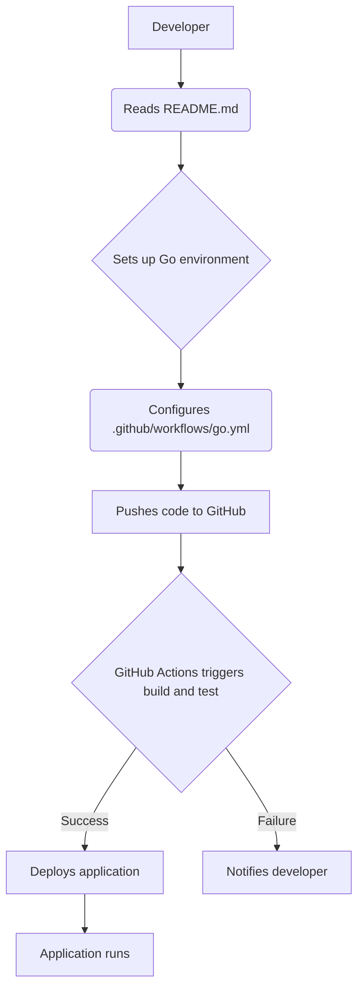
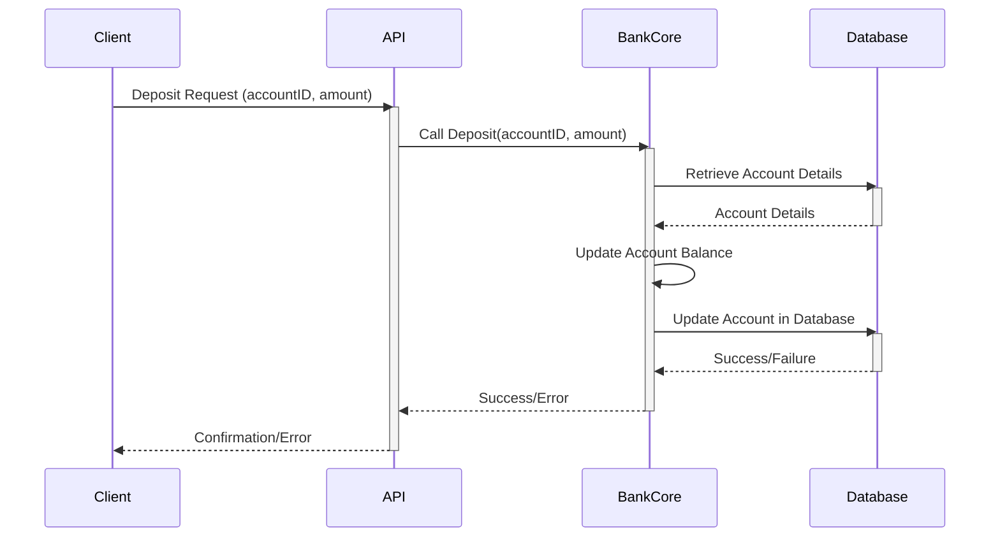
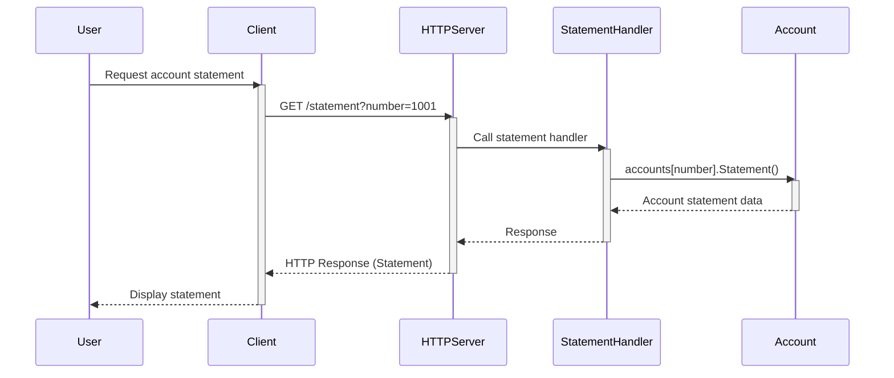
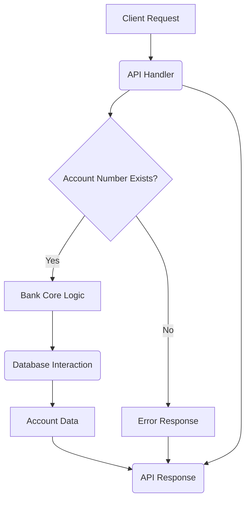

# Wiki Documentation for https://github.com/pomcho555/go-bank-handson

Generated on: 2025-05-07 14:48:47

## Table of Contents

- [Introduction and Setup](#page-1)
- [Core Banking Functionality](#page-2)
- [API Endpoints](#page-3)
- [Testing Strategy](#page-4)

<a id='page-1'></a>

## Introduction and Setup

### Related Files

- `README.md`
- `.github/workflows/go.yml`

### Related Pages

Related topics: [Core Banking Functionality](#page-2), [API Endpoints](#page-3)

## Introduction and Setup

This page provides an introduction to setting up and understanding the `go-bank-handson` repository. It focuses on the initial steps to get the project running and explains the key components involved.

This project demonstrates a simple banking API implemented in Go, covering basic functionalities such as account management (deposit, withdrawal, and statement).

### Key Files for Setup and Introduction

The following files are essential for understanding the project's structure and initial setup:

*   **`README.md`**: The primary entry point for newcomers, providing an overview and setup instructions.
*   **`.github/workflows/go.yml`**: Defines the CI/CD pipeline for automated testing and building using GitHub Actions.
*   **`src/bankapi/main.go`**: Contains the main application logic for the bank API server, handling HTTP requests and interacting with the core banking logic.

### Purpose and Functionality

*   **`README.md`**: Provides a high-level overview of the project, guiding users on how to get started. It serves as the first point of contact for understanding the project.

    ```markdown
    # go-bank-handson
    ```

*   **`.github/workflows/go.yml`**: Automates the build and test process. It defines a workflow that triggers on push and pull request events, setting up the Go environment, checking out the code, and running tests.

    ```yaml
    name: Go

    on:
      push:
        branches: [ "main" ]
      pull_request:
        branches: [ "main" ]

    jobs:

      build:
        runs-on: ubuntu-latest
        steps:
        - uses: actions/checkout@v3

        - name: Set up Go
          uses: actions/setup-go@v4
          with:
            go-version: '1.21'

        - name: Build
          run: go build -v ./...

        - name: Test
          run: go test -v ./...
    ```

*   **`src/bankapi/main.go`**: Acts as the application's entry point, initializing the application state and setting up the HTTP server. It defines routes such as `/statement`, `/deposit`, and `/withdraw`, handling incoming requests and interacting with the core banking logic.

    ```go
    func main() {
    	accounts[1001] = &bank.Account{
    		Customer: bank.Customer{
    			Name:    "John",
    			Address: "Los Angeles, California",
    			Phone:   "(213) 555 0147",
    		},
    		Number: 1001,
    	}

    	http.HandleFunc("/statement", statement)
    	http.HandleFunc("/deposit", deposit)
    	http.HandleFunc("/withdraw", withdraw)
    	log.Fatal(http.ListenAndServe("localhost:8000", nil))
    }
    ```

### Integration with Overall Architecture

The `README.md` file is crucial for initial user interaction and setup, guiding users on how to build and run the application.

The `.github/workflows/go.yml` file automates the testing and building of the application, ensuring code quality and reliability.

The `src/bankapi/main.go` file represents the API layer, handling HTTP requests and responses. It depends on the `bankcore` package to perform banking operations.

This structure separates concerns, with the API layer handling web requests and the core layer handling the actual banking logic.

### Setup and Workflow

The following diagram illustrates the setup and workflow of the project:



### Sources

Sources: <a href="https://github.com/pomcho555/go-bank-handson/blob/main/README.md" target="_blank" rel="noopener noreferrer" class="mb-1 mr-1 inline-flex items-stretch font-mono text-xs !no-underline">README.md</a> <a href="https://github.com/pomcho555/go-bank-handson/blob/main/.github/workflows/go.yml" target="_blank" rel="noopener noreferrer" class="mb-1 mr-1 inline-flex items-stretch font-mono text-xs !no-underline">.github/workflows/go.yml</a> <a href="https://github.com/pomcho555/go-bank-handson/blob/main/src/bankapi/main.go" target="_blank" rel="noopener noreferrer" class="mb-1 mr-1 inline-flex items-stretch font-mono text-xs !no-underline">src/bankapi/main.go</a>


---

<a id='page-2'></a>

## Core Banking Functionality

### Related Files

- `src/bankcore/bank.go`
- `src/bankcore/bank_test.go`

### Related Pages

Related topics: [Introduction and Setup](#page-1), [API Endpoints](#page-3)

## Core Banking Functionality

This page details the core banking functionalities within the `go-bank-handson` repository, focusing on the `bankcore` package. This package manages fundamental banking operations, separate from external interfaces.

### Purpose and Functionality

The `bankcore` package (`src/bankcore/`) handles the essential business logic of a banking system. It manages customer and account data and provides methods for banking transactions, ensuring reusability and testability independently of the API layer.

Key functionalities:

*   Defining `Customer` and `Account` structures.
*   Deposits.
*   Withdrawals.
*   Account statements.
*   Transfers between accounts.

### File Breakdown

#### `src/bankcore/bank.go`

This file implements the core banking logic, defining data structures and methods for accounts and customers.

*   **`Customer` Struct:** Represents a bank customer.

    ```go
    type Customer struct {
    	Name    string
    	Address string
    	Phone   string
    }
    ```

*   **`Account` Struct:** Represents a bank account, embedding the `Customer` struct and including `Number` and `Balance` fields.

    ```go
    type Account struct {
    	Customer
    	Number  int32
    	Balance float64
    }
    ```

*   **Methods:** The `Account` struct includes methods for banking operations:

    *   `Deposit(amount float64) error`: Adds funds; returns an error for non-positive amounts.
    *   `Withdraw(amount float64) error`: Removes funds; returns an error for non-positive amounts or insufficient balance.
    *   `Statement() string`: Returns a formatted account statement.
    *   `Transfer(amount float64, dest *Account) error`: Transfers funds, using `Withdraw` and `Deposit`, handling insufficient funds or non-positive amounts.

#### `src/bankcore/bank_test.go`

This file contains unit tests for `src/bankcore/bank.go`, verifying the core logic under various conditions.

The tests cover:

*   Account creation (`TestAccount`).
*   Depositing funds, including invalid amounts (`TestDeposit`, `TestDepositInvalid`).
*   Withdrawing funds (`TestWithdraw`).
*   Generating account statements (`TestStatement`).
*   Transferring funds, including invalid transfers (`TestTransfer`, `TestTransferInvalid`).

These tests use Go's `testing` package to assert the correctness of `bankcore` functions.

### Integration with Overall Architecture

The `bankcore` package is the foundation for the banking application. The API layer (`src/bankapi/main.go`) uses `bankcore`'s functions and data structures. For instance, a deposit request to the API is handled by parsing parameters, finding the `bank.Account` object, and calling the `account.Deposit()` method from `bankcore`.

This layered architecture separates core business logic from the interface, making the core logic independent and maintainable.

### Sequence Diagram: Deposit Transaction

This diagram illustrates a deposit transaction using a sequence diagram.



Sources: <a href="https://github.com/pomcho555/go-bank-handson/blob/main/src/bankcore/bank.go" target="_blank" rel="noopener noreferrer" class="mb-1 mr-1 inline-flex items-stretch font-mono text-xs !no-underline">src/bankcore/bank.go</a> <a href="https://github.com/pomcho555/go-bank-handson/blob/main/src/bankcore/bank_test.go" target="_blank" rel="noopener noreferrer" class="mb-1 mr-1 inline-flex items-stretch font-mono text-xs !no-underline">src/bankcore/bank_test.go</a>


---

<a id='page-3'></a>

## API Endpoints

### Related Files

- `src/bankapi/main.go`
- `src/bankapi/main_test.go`

### Related Pages

Related topics: [Introduction and Setup](#page-1), [Core Banking Functionality](#page-2)

## API Endpoints

This page details the API endpoints for the `go-bank-handson` application, focusing on the `src/bankapi` package.

### Introduction

The `src/bankapi` package serves as the entry point for the bank's API. It exposes banking functionalities defined in `src/bankcore` through HTTP endpoints. It manages incoming requests, processes parameters, calls core banking functions, and formulates responses.

### Purpose and Functionality

The API offers the following endpoints:

*   `/statement`: Retrieves account balance and details.
*   `/deposit`: Adds funds to an account.
*   `/withdraw`: Removes funds from an account.

These endpoints are implemented as HTTP handlers in `src/bankapi/main.go`.

### Implementation Details (`src/bankapi/main.go`)

The `main.go` file initializes the HTTP server and defines handlers for each endpoint. It uses an in-memory map (`accounts`) for storing account data, initialized within the `main` function.

```go
var accounts = map[float64]*bank.Account{}

func main() {
	accounts[1001] = &bank.Account{
		Customer: bank.Customer{
			Name:    "John",
			Address: "Los Angeles, California",
			Phone:   "(213) 555 0147",
		},
		Number: 1001,
	}

	http.HandleFunc("/statement", statement)
	http.HandleFunc("/deposit", deposit)
	http.HandleFunc("/withdraw", withdraw)
	log.Fatal(http.ListenAndServe("localhost:8000", nil))
}
```

Each handler (`statement`, `deposit`, `withdraw`) extracts parameters from the request's query string (`req.URL.Query().Get(...)`), validates them, retrieves the account from the `accounts` map, calls the relevant `bank.Account` method (from `bankcore`), and sends a response or error message.

Below is a snippet from the `withdraw` handler:

```go
func withdraw(w http.ResponseWriter, req *http.Request) {
	numberqs := req.URL.Query().Get("number")
	amountqs := req.URL.Query().Get("amount")

	if numberqs == "" {
		fmt.Fprintf(w, "Account number is missing!")
		return
	}

	if number, err := strconv.ParseFloat(numberqs, 64); err != nil {
		fmt.Fprintf(w, "Invalid account number!")

	} else if amount, err := strconv.ParseFloat(amountqs, 64); err != nil {
		fmt.Fprintf(w, "Invalid amount number!")
	} else {
		account, ok := accounts[number]
		if !ok {
			fmt.Fprintf(w, "Account with number %v can't be found!", number)

		} else {
			err := account.Withdraw(amount)
			if err != nil {
				fmt.Fprintf(w, "%v", err)
			} else {
				fmt.Fprintf(w, account.Statement())
			}
		}
	}

}
```

### Testing (`src/bankapi/main_test.go`)

The `main_test.go` file includes unit tests for the API handlers. It employs `net/http/httptest` to create mock HTTP requests and response recorders, enabling isolated testing of handlers without a live HTTP server.

```go
func TestStatement(t *testing.T) {
	accounts[1001] = &bank.Account{
		Customer: bank.Customer{
			Name:    "John",
			Address: "Los Angeles, California",
			Phone:   "(213) 555 0147",
		},
		Number: 1001,
	}

	req := httptest.NewRequest("GET", "/statement?number=1001", nil)
	w := httptest.NewRecorder()
	statement(w, req)
	res := w.Result()
	defer res.Body.Close()
	data, err := ioutil.ReadAll(res.Body)
	if err != nil {
		t.Errorf("expected error to be nil got %v", err)
	}
	if string(data) != "1001 - John - 0" {
		t.Errorf("expected string got %v", string(data))
	}
}
```

### Architectural Integration

The `src/bankapi` package acts as the API layer. It relies on the `src/bankcore` package, which contains the core banking logic (`Account`, `Deposit`, `Withdraw`, `Statement`, `Transfer`). The `bankapi` handlers translate external requests into calls to `bankcore` methods and format the results into HTTP responses. This separation allows independent testing of the core logic and potential reuse by other interfaces.

### Sequence Diagram (Statement)



Sources: <a href="https://github.com/pomcho555/go-bank-handson/blob/main/src/bankapi/main.go" target="_blank" rel="noopener noreferrer" class="mb-1 mr-1 inline-flex items-stretch font-mono text-xs !no-underline">src/bankapi/main.go</a>, <a href="https://github.com/pomcho555/go-bank-handson/blob/main/src/bankapi/main_test.go" target="_blank" rel="noopener noreferrer" class="mb-1 mr-1 inline-flex items-stretch font-mono text-xs !no-underline">src/bankapi/main_test.go</a>


---

<a id='page-4'></a>

## Testing Strategy

### Related Files

- `src/bankcore/bank_test.go`
- `src/bankapi/main_test.go`

### Related Pages

Related topics: [Core Banking Functionality](#page-2), [API Endpoints](#page-3)

## Testing Strategy

This document describes the testing strategy for the `go-bank-handson` repository. The goal is to ensure the reliability and correctness of the banking application through comprehensive testing.

### Purpose and Functionality

The testing strategy focuses on validating the core banking logic and API endpoints. Key objectives include:

*   Verifying basic operations like deposits, withdrawals, and transfers.
*   Ensuring API endpoints correctly handle requests and responses.
*   Preventing regressions as the codebase evolves.

### Core Logic Testing (`src/bankcore/bank_test.go`)

`src/bankcore/bank_test.go` contains unit tests for the `bankcore` package. These tests verify the behavior of the `Account` type and its methods (`Deposit`, `Withdraw`, `Statement`, `Transfer`).

Example tests:

*   Successful deposits and withdrawals.
*   Handling invalid deposit amounts.
*   Verifying the account statement format.
*   Valid and invalid transfer scenarios.

```go
func TestDeposit(t *testing.T) {
	account := Account{
		Customer: Customer{
			Name:    "John",
			Address: "Los Angeles, California",
			Phone:   "(213) 555 0147",
		},
		Number:  1001,
		Balance: 0,
	}

	account.Deposit(10)

	if account.Balance != 10 {
		t.Error("balance is not being updated after a deposit")
	}
}
```

Sources: <a href="https://github.com/pomcho555/go-bank-handson/blob/main/src/bankcore/bank_test.go" target="_blank" rel="noopener noreferrer" class="mb-1 mr-1 inline-flex items-stretch font-mono text-xs !no-underline">src/bankcore/bank_test.go</a>

### API Endpoint Testing (`src/bankapi/main_test.go`)

`src/bankapi/main_test.go` contains integration tests for the HTTP API endpoints (`/statement`, `/deposit`, `/withdraw`). These tests simulate HTTP requests and check the responses.

The current test verifies the `/statement` endpoint, ensuring it retrieves and formats account information correctly.

```go
func TestStatement(t *testing.T) {
	accounts[1001] = &bank.Account{
		Customer: bank.Customer{
			Name:    "John",
			Address: "Los Angeles, California",
			Phone:   "(213) 555 0147",
		},
		Number: 1001,
	}

	req := httptest.NewRequest("GET", "/statement?number=1001", nil)
	w := httptest.NewRecorder()
	statement(w, req)
	res := w.Result()
	defer res.Body.Close()
	data, err := ioutil.ReadAll(res.Body)
	// ... assertions ...
}
```

Sources: <a href="https://github.com/pomcho555/go-bank-handson/blob/main/src/bankapi/main_test.go" target="_blank" rel="noopener noreferrer" class="mb-1 mr-1 inline-flex items-stretch font-mono text-xs !no-underline">src/bankapi/main_test.go</a>

### Integration with Overall Architecture

The testing strategy supports the application's layered architecture:

1.  **Core Logic Layer (`bankcore`):** Unit tests in `src/bankcore/bank_test.go` ensure the business logic is sound.
2.  **API Layer (`bankapi`):** Integration tests in `src/bankapi/main_test.go` verify the API handlers correctly use the core logic and handle HTTP interactions.

This separation enables focused testing at each layer.



This diagram illustrates the flow of a request from the client, through the API handler, to the core logic and database, and back to the client with a response.


---

